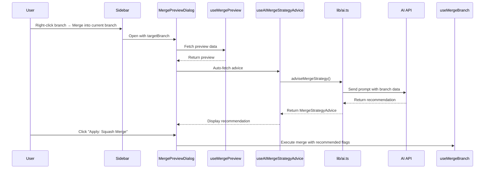

# AI Merge Strategy Advisor — Design Spec

## Goal

Add an AI-powered merge strategy advisor to the MergePreviewDialog that analyzes branch state and recommends the best merge strategy (merge commit, rebase, squash merge, or fast-forward) with reasoning.

## What Already Exists

- **MergePreviewDialog**: Shows branch selector, ahead/behind stats, incoming commits, changed files, squash toggle, and merge button
- **MergePreview backend**: Returns `ahead`, `behind`, `incoming_commits[]` (hash, message, author), `changed_files[]` (path, status, additions, deletions)
- **useMergeBranch hook**: Supports `squash` and `noFF` flags
- **AI function pattern**: `readAISettings()` → `hasProvider()` → build prompt → `requestAIText()` → `cleanAIText()`
- **Sidebar context menu**: "Merge into current branch..." opens MergePreviewDialog

## Strategy Options

The advisor will recommend one of four strategies:

| Strategy | Git Command | When to Use |
|----------|------------|-------------|
| **Fast-forward** | `git merge --ff-only` | Linear history, no divergent commits |
| **Merge commit** | `git merge --no-ff` | Preserve branch topology, feature branches |
| **Squash merge** | `git merge --squash` | Clean history, many small commits |
| **Rebase** | `git rebase` + `git merge --ff-only` | Clean linear history, shared branch not yet pushed |

## Files to Create

None — all changes are to existing files.

## Files to Modify

### 1. `apps/desktop/src/lib/ai.ts`

Add `MergeStrategyAdvice` interface and `adviseMergeStrategy()` function.

**Interface:**
```typescript
export interface MergeStrategyRecommendation {
  strategy: "merge" | "rebase" | "squash" | "fast-forward";
  confidence: "high" | "medium" | "low";
  reasoning: string;
  pros: string[];
  cons: string[];
}

export interface MergeStrategyAdvice {
  recommendation: MergeStrategyRecommendation;
  alternatives: MergeStrategyRecommendation[];
  summary: string;
}
```

**Function signature:**
```typescript
export async function adviseMergeStrategy(
  repoPath: string,
  currentBranch: string,
  targetBranch: string,
  ahead: number,
  behind: number,
  incomingCommits: Array<{ hash: string; message: string; author: string }>,
  changedFiles: Array<{ path: string; status: string; additions: number; deletions: number }>,
): Promise<MergeStrategyAdvice>
```

**Prompt design:**
- Provide branch comparison data (ahead/behind counts, commit messages, file changes)
- Ask AI to analyze and recommend the best strategy
- Request structured JSON response with recommendation, alternatives, and reasoning
- Parse JSON from AI response (with fallback for non-JSON responses)

### 2. `apps/desktop/src/queries/useAI.ts`

Add `useAIMergeStrategyAdvice()` hook following the existing mutation pattern.

```typescript
export function useAIMergeStrategyAdvice(repoPath: string | null) {
  return useMutation({
    mutationKey: ["ai.merge-strategy-advice"],
    mutationFn: ({
      currentBranch,
      targetBranch,
      ahead,
      behind,
      incomingCommits,
      changedFiles,
    }: { ... }) => {
      if (!repoPath) throw new Error("No repository selected");
      return adviseMergeStrategy(repoPath, currentBranch, targetBranch, ahead, behind, incomingCommits, changedFiles);
    },
  });
}
```

### 3. `apps/desktop/src/components/features/dialogs/MergePreviewDialog.tsx`

Major UI changes to integrate the AI advisor.

**New UI elements:**
1. Add "AI Strategy Advisor" section below the preview stats
2. Auto-fetch advice when preview loads (using `useEffect` + `useAIMergeStrategyAdvice`)
3. Display recommendation card with:
   - Strategy name + icon (GitMerge, GitBranch, GitCommit, FastForward)
   - Confidence badge (high/medium/low with color coding)
   - Reasoning text (markdown-rendered)
   - Pros/cons as bullet lists
4. Show alternative strategies as collapsible section
5. Update footer buttons to reflect the recommended strategy:
   - "Apply Recommended: Squash Merge" (primary button)
   - "Merge" / "Squash Merge" / "Cancel" as secondary options
6. When user clicks "Apply", execute the recommended strategy via `useMergeBranch`

**Layout:**
```
┌─────────────────────────────────────────────┐
│ Header: Merge Branch                        │
├─────────────────────────────────────────────┤
│ Source Branch selector                      │
├─────────────────────────────────────────────┤
│ Preview content (ahead/behind, commits)     │
├─────────────────────────────────────────────┤
│ ✨ AI Strategy Advisor                      │
│ ┌─────────────────────────────────────────┐ │
│ │ Recommended: Squash Merge (High)        │ │
│ │ Reasoning: 12 small commits...          │ │
│ │ ✅ Clean history                        │ │
│ │ ⚠️ Loses individual commit details      │ │
│ └─────────────────────────────────────────┘ │
│ Alternatives:                               │
│   • Merge commit — preserves topology       │
│   • Rebase — clean linear history           │
│   • Fast-forward — not applicable           │
├─────────────────────────────────────────────┤
│ Footer: [Cancel] [Apply: Squash Merge]      │
└─────────────────────────────────────────────┘
```

### 4. `apps/desktop/src/components/features/dialogs/FeatureGuideDialog.tsx`

Add feature entry in "AI Features" section:
- Title: "AI Merge Strategy Advisor"
- Description: "AI analyzes branch state and recommends the best merge strategy"
- Steps: Select branch → Preview loads → AI recommends strategy → Apply with one click
- Icon: `GitMerge` from lucide-react

### 5. `apps/desktop/src/components/features/dialogs/FeatureIllustrations.tsx`

Add `MergeStrategyAdvisorFeatureIllustration` SVG component showing:
- Three strategy cards (merge, rebase, squash) with the recommended one highlighted
- A sparkle/AI indicator on the recommended card

## Data Flow



## Edge Cases

1. **AI not configured**: Hide the advisor section entirely (check `hasProvider`)
2. **AI request fails**: Show subtle error message, fallback to manual strategy selection
3. **Fast-forward possible**: AI should detect when `behind > 0` and `ahead === 0` and recommend fast-forward
4. **Up-to-date branches**: No recommendation needed (preview already handles this)
5. **Large number of commits**: Truncate commit list in prompt to avoid token limits
6. **JSON parse failure**: Fallback to parsing free-text recommendation
7. **Rebase requires checkout**: Note in the recommendation that rebase changes the current branch state

## Verification

1. Open a repo with divergent branches
2. Right-click a branch → "Merge into current branch"
3. Verify AI advisor section appears with recommendation
4. Verify recommendation makes sense for the branch state
5. Click "Apply" and verify the correct merge strategy is executed
6. Test with AI disabled — verify advisor section is hidden
7. Test with fast-forwardable branches — verify fast-forward recommendation
8. Run `npx tsc --noEmit` — verify zero TypeScript errors
